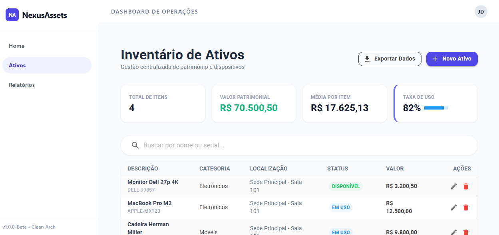
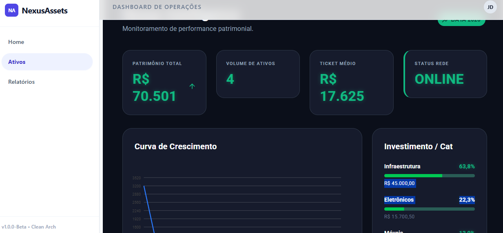

# 🚀 NexusAssets - Enterprise Asset Management System

O **NexusAssets** é uma plataforma robusta de Gestão de Ativos (EAM) projetada para centralizar o controle de inventário físico e digital de empresas. Desenvolvido com foco em escalabilidade e performance, o sistema utiliza as tecnologias mais recentes do ecossistema .NET.

---

## 🛠️ Stack Tecnológica & Arquitetura

O projeto foi construído seguindo boas práticas de desenvolvimento moderno:

- **Frontend & Backend:** [ASP.NET Core 9.0](https://dotnet.microsoft.com/en-us/apps/aspnet) com **Blazor WebApp** (Interactive Server Mode).
- **UI Framework:** [MudBlazor](https://mudblazor.com/) para uma interface rica, responsiva e baseada em Material Design.
- **Persistência de Dados:** [Entity Framework Core](https://learn.microsoft.com/en-us/ef/core/) com suporte inicial a **SQLite** (extensível para SQL Server/PostgreSQL).
- **Containerização:** Orquestrado via **Docker** para garantir paridade entre ambientes de desenvolvimento e produção.
- **Deploy Automático:** Configurado com CI/CD para o **Render**.

---

## 🚧 Estado Atual: Em Construção (Active Development)

Este projeto está em fase de **Desenvolvimento Ativo**. Atualmente, estamos consolidando a estrutura de dados e as interfaces de gestão core. 

---

## ✨ Funcionalidades Principais

### ✅ Implementado ou em Progresso:
- **Dashboard Executivo:** Visualização rápida do status dos ativos através de gráficos dinâmicos.
- **Gestão de Inventário:** CRUD completo de ativos com categorização e localização.
- **Rastreabilidade de Localização:** Histórico de onde cada equipamento está alocado.
- **Relatórios Dinâmicos:** Filtros avançados para exportação e análise de dados.

### 📅 Roadmap (Próximas Fases):
- **Sistema de Autenticação:** Implementação de Identity e RBAC (Role-Based Access Control).
- **Auditoria de Ativos:** Log de alterações para conformidade e segurança.
- **Integração com API Externa:** Consumo de dados para atualização de preços e depreciação.

---

## 📸 Screenshots do Sistema

### Interface de Monitorização


### Gestão de Ativos e Relatórios


---

## 🚀 Como Rodar o Ambiente de Desenvolvimento

### Pré-requisitos
- .NET 9 SDK
- Docker (opcional, para testes de deploy)

### Execução Local
1. Clone este repositório:
   ```bash
   git clone [https://github.com/FlavioCraftsCode/NexusAssets.git](https://github.com/FlavioCraftsCode/NexusAssets.git)
